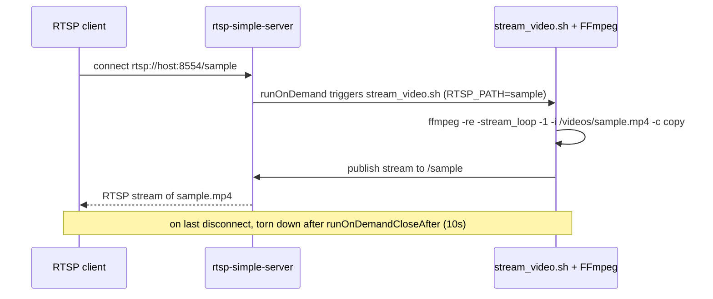

# rtsp-media-server

> Stream local video files as on-demand RTSP camera feeds.

[](LICENSE)
[](Dockerfile)
[](https://github.com/aler9/rtsp-simple-server/tree/v0.14.1)
[](https://ffmpeg.org/)
[](CONTRIBUTING.md)

`rtsp-media-server` turns a directory of `.mp4` files into virtual RTSP
cameras. It wraps [rtsp-simple-server][rss] in a Docker image and uses
[FFmpeg][ffmpeg] to publish a stream **only when a client connects** — no CPU
is spent looping video that nobody is watching.

This is handy for testing and developing video pipelines (NVRs, analytics,
computer-vision services) without physical IP cameras.

## How it works



1. A client requests `rtsp://<host>:8554/<name>`.
2. rtsp-simple-server's [`runOnDemand`][ondemand] hook runs
   [`stream_video.sh`](stream_video.sh) with `RTSP_PATH=<name>`.
3. The script loops `/videos/<name>.mp4` with FFmpeg and re-publishes it to
   the same RTSP path with `-c copy` (no transcoding).
4. When the last client disconnects, the stream is torn down after
   `runOnDemandCloseAfter` (10s by default).

So a file at `videos/sample.mp4` is served at `rtsp://<host>:8554/sample`.

## Requirements

- [Docker](https://docs.docker.com/get-docker/)
- One or more `.mp4` files to serve
- An RTSP client to view streams — e.g. [VLC](https://www.videolan.org/),
  [`ffplay`](https://ffmpeg.org/ffplay.html), or `mpv`

## Quick start

```bash
# 1. Build the image
make docker

# 2. Put video files in ./videos (a sample is included)
ls videos/            # sample.mp4

# 3. Run, mounting your videos directory
make runlocal
# equivalent to:
#   docker run --rm -d --network=host -v ${PWD}/videos:/videos \
#     --name rtsp_media_server rtsp_media_server

# 4. Play a stream (filename without .mp4 = stream name)
ffplay rtsp://localhost:8554/sample
# or: vlc rtsp://localhost:8554/sample

# 5. Stop
make stoplocal
```

`--network=host` is used so the container shares the host's ports. On macOS and
Windows, where host networking is limited, publish the ports explicitly
instead:

```bash
docker run --rm -d -p 8554:8554 -v ${PWD}/videos:/videos \
  --name rtsp_media_server rtsp_media_server
```

## Configuration

| What | Where | Default |
|------|-------|---------|
| RTSP port | `rtspPort` in [`rtsp-simple-server.yml`](rtsp-simple-server.yml) | `8554` |
| Videos directory | `-v <host_dir>:/videos` mount | `./videos` |
| On-demand command | `runOnDemand` in the `.yml` | `./stream_video.sh` |
| Idle teardown | `runOnDemandCloseAfter` | `10s` |
| Log level | `logLevel` | `debug` |

The script reads two environment variables that rtsp-simple-server sets per
request: `RTSP_PATH` (the stream name) and `RTSP_PORT`. See
[`stream_video.sh`](stream_video.sh) and the upstream
[configuration reference][rss-config] for all options.

## Pushing to a registry

The [`Makefile`](Makefile) supports pushing to an Amazon ECR repository:

```bash
ECR_REPO=<account>.dkr.ecr.<region>.amazonaws.com \
TAG_VERSION=v1 \
make push
```

## A note on the upstream project

This image pins [rtsp-simple-server][rss] **v0.14.1**. The upstream project
has since been **renamed to [MediaMTX](https://github.com/bluenviron/mediamtx)**
and its configuration schema has evolved. This repository intentionally
tracks the pinned v0.14.1 config for stability; if you upgrade the version in
the [`Dockerfile`](Dockerfile), review the MediaMTX migration notes, as some
keys in `rtsp-simple-server.yml` may have changed or been removed.

## Repository layout

| File | Purpose |
|------|---------|
| [`Dockerfile`](Dockerfile) | Builds the image (FFmpeg + rtsp-simple-server) |
| [`Makefile`](Makefile) | `docker`, `push`, `runlocal`, `stoplocal` targets |
| [`rtsp-simple-server.yml`](rtsp-simple-server.yml) | rtsp-simple-server config (defines the on-demand behavior) |
| [`stream_video.sh`](stream_video.sh) | On-demand FFmpeg publisher |
| [`example.sh`](example.sh) | Sample `docker run` invocation |
| [`videos/`](videos/) | Default mount point for `.mp4` files |

## Contributing

Contributions are welcome — see [CONTRIBUTING.md](CONTRIBUTING.md).

## License

Licensed under the [Apache License 2.0](LICENSE). See also [NOTICE](NOTICE).

[rss]: https://github.com/aler9/rtsp-simple-server
[rss-config]: https://github.com/aler9/rtsp-simple-server/blob/v0.14.1/rtsp-simple-server.yml
[ondemand]: https://github.com/aler9/rtsp-simple-server/tree/v0.14.1#on-demand-publishing
[ffmpeg]: https://ffmpeg.org/
